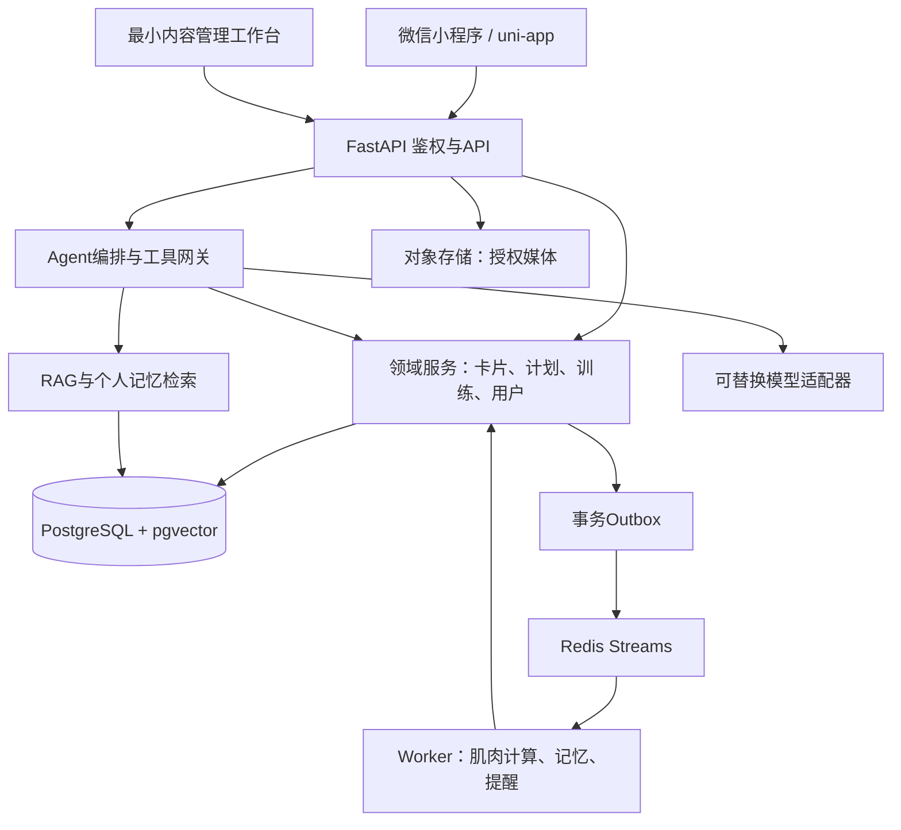

# 项目总体设计

版本：v1.0｜日期：2026-09-25｜状态：C01—C10建议方案已由用户确认

## 1. 产品目标与边界

FitMind 是以对话为入口的健身陪伴小程序。用户通过“了解自己 → 制定计划 → 执行训练 → 看见变化 → 调整计划”形成闭环；资料卡承载长期信息，知识引用增强建议可核查性，肌肉图解释训练覆盖和估算疲劳。

建议首批服务有基础健身条件的成年新手及进阶者。首版不承诺诊断、康复治疗、真实肌肉测量、保证增肌减脂或突破成绩。首版成功定义为用户能持续记录并理解训练建议，而非聊天次数增长。

## 2. 系统结构

建议模块化单体，API与Worker独立进程。避免在首版引入微服务运维成本。PostgreSQL为事实来源，Redis仅缓存与任务传输；客户端和模型均不能直接写数据库。

## 3. 技术基线

| 层 | 建议选型 | 取舍 |
|---|---|---|
| 小程序 | uni-app、Vue3、TypeScript、Pinia、SCSS | 延续原文；真机优先验证 |
| 可视化 | 受控SVG资产+图片/点击层；Canvas备用 | 不依赖浏览器SVG DOM能力 |
| 后端 | Python 3.12独立Conda环境、FastAPI、Pydantic、SQLAlchemy、Alembic | 与base隔离，统一输入校验与迁移 |
| 数据 | PostgreSQL16、pgvector | JSONB灵活字段和关系约束并存 |
| 异步 | Redis Streams、事务Outbox、独立Worker | 可补发、可观测；重复消费幂等 |
| Agent | LangGraph状态编排+自有工具网关+供应商适配器 | 主教练与专项子图；领域事务保持独立，见19 |
| 检索 | 中文关键词+向量、可选重排 | 模型与维度配置版本化 |
| 部署 | Docker Compose、托管数据库可选、CI流水线 | 具体云厂商待确认；单机有故障窗口 |

供应商、精确依赖版本、区域和价格在获准开工后的技术验证里冻结，不能把“可替换”理解为未经评测即可热切换。

## 4. 关键数据流

1. 对话：鉴权 → 保存消息及运行ID → 安全分流 → 获取个人上下文/知识 → 提议工具动作 → 服务端校验执行 → 保存结果 → 返回回复、卡片版本和引用。
2. 完成训练：训练状态CAS校验 → 训练记录和outbox同事务提交 → 返回已保存 → Worker计算肌肉投影 → 产生更新事件 → 前端刷新。计算失败不丢训练记录。
3. 修改历史：新增修订版本 → 废弃旧投影输入 → 从有效事实重算 → 原有报告保留版本说明。
4. 主动提醒：扫描到期任务 → 检查授权/静默/频控 → 生成站内消息 → 尝试订阅通知；外部推送失败不反复调用模型。

## 5. 非功能目标（待压测）

| 指标 | MVP建议目标 | 测量条件 |
|---|---|---|
| API延迟 | 非AI接口p95≤500ms | 100并发用户，10万条训练明细，连续30分钟 |
| AI响应 | 首段/进度反馈p95≤5s；最终p95≤30s | 20并发生成，固定评测集、指定供应商 |
| 异步更新 | 完成训练后肌肉投影p95≤10s | 100次/分钟训练完成峰值 |
| 可用性 | 内测月度99.5% | 以核心API探测统计，维护计入 |
| 前端 | 缓存启动可交互≤2s，冷启动≤4s | 真机Wi-Fi与4G分别报告 |
| 数据 | 已确认训练不因任务系统中断丢失 | outbox补偿演练 |
| 灾备 | RPO≤24h，RTO≤4h | 每日备份且恢复演练通过；正式商用另评估 |

## 6. 演进触发

Agent运行采用可持久化状态图、带版本的检查点、业务工具回执、确认票据、用户级执行租约和硬预算。检查点不替代数据库事务；恢复依赖工具幂等回执。完整设计及新验收案例见[19-Agent架构优化设计](19-Agent架构优化设计.md)。

只有出现经监控证实的瓶颈才引入独立搜索/向量集群、复杂编排或服务拆分。多场馆租户、支付结算和教练权限需要单独设计；当前为其保留逻辑边界，不宣称已支持。
