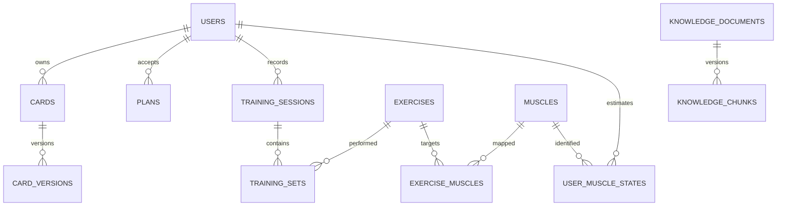

# 数据模型与数据治理

版本：v1.0｜日期：2026-09-25｜状态：C01—C10建议方案已由用户确认

## 1. 通用约定

业务ID用UUID，字典ID用稳定字符串；时间用timestamptz存UTC，显示按用户时区，默认Asia/Shanghai。实体created_at/updated_at必填，可变实体含version正整数。小数用numeric，未知使用null，不用0冒充未知。

核心事实采用关系字段和约束，自定义内容用JSONB。用户只保存一份逻辑隔离的训练库，不为每个用户创建物理数据库。所有用户子实体user_id外键必填，并在关联对象时验证同属一人。

## 2. 实体字典

| 表 | 主要字段 | 约束/索引 |
|---|---|---|
| users | id, openid, nickname, timezone, status | openid唯一；不采用SQL保留词user |
| user_consents | id,user_id,purpose,policy_version,granted_at,revoked_at | 用户+用途+时间索引；保留授权证据 |
| auth_sessions | id,user_id,refresh_hash,expires_at,revoked_at | 哈希唯一，按user_id撤销 |
| profiles | id,user_id,content,confirmed_fields,version | 每用户一个当前画像，JSONB字段带来源 |
| cards | id,user_id,type,title,content,display,status,version,schema_version | (user_id,status)；标题≤100字 |
| card_versions | id,card_id,user_id,version,snapshot,actor,reason | (card_id,version)唯一；快照包括展示属性 |
| card_types | id,owner_user_id,type_key,schema,schema_version,status | 用户自定义类型仅本人作用域；全局类型由审核员管理 |
| plans | id,user_id,version,status,content,accepted_at | 每用户至多一个active，采用部分唯一索引 |
| training_sessions | id,user_id,plan_id,plan_snapshot,status,started_at,ended_at,version | user_id+started_at索引；结束≥开始 |
| training_sets | id,user_id,session_id,exercise_id,ordinal,reps,weight_kg,load_mode,implement_count,rpe,completed | (session_id,exercise_id,ordinal)唯一；reps≥1；weight≥0；RPE为1—10或null |
| training_revisions | id,user_id,session_id,revision,before,after,reason | 会话+revision唯一；历史修订不可直接覆盖 |
| muscles | id,name,parent_id,group_key,anatomical_note,status | parent禁止自环；后束跨分组引用同一个id |
| exercises | id,name,aliases,instructions,errors,media_refs,status,version | 发布状态索引；内容引用知识版本 |
| exercise_muscles | exercise_id,muscle_id,role,weight,version | 组合唯一；weight在0—1，专家审核 |
| equipment | id,name,category,adjustment_spec,tips,status | 通用设备类型，无虚构场馆位置 |
| exercise_equipment | exercise_id,equipment_id,required | 组合唯一；替代器材明确可选 |
| gym_equipment_instances（V1） | id,gym_id,equipment_id,location,model | 场馆实例才有位置/型号 |
| user_muscle_states | user_id,muscle_id,fatigue,stimulation,recovery,last_trained,frequency,confidence,as_of,algorithm_version,source_revision | (user_id,muscle_id)唯一；指标0—100或null |
| conversations/messages | id,user_id,conversation_id,role,content,client_message_id,created_at | (user_id,client_message_id)唯一，历史游标索引 |
| agent_runs/tool_runs | id,user_id,message_id,status,tool_name,input_hash,result_ref,trace_id,cost | run+tool_call_id唯一；不存内部思维过程 |
| tool_executions | user_id,run_id,tool_call_id,params_hash,status,receipt,completed_at | (user_id,run_id,tool_call_id)唯一；成功回执与领域写入同事务，tool_runs仅观测 |
| agent_checkpoints | checkpointer管理表+user_id/run_id映射,graph_version,expires_at | LangGraph持久化状态；服务端按用户过滤，不直接对外暴露thread_id |
| action_confirmations | id,user_id,run_id,proposal_hash,resource_versions,state_version,status,expires_at,result_ref | 单次原子消费；归属/版本/期限均校验 |
| agent_execution_leases | user_id,run_id,fencing_token,lease_until | user_id唯一；token单调增长；写入时核验 |
| model_budget_reservations | id,user_id,run_id,call_id,reserved_amount,actual_amount,status | call_id唯一，用户/全局额度原子预留与结算 |
| memories | id,user_id,source_ref,content,confirmed,expires_at,embedding,embedding_version,status | user_id过滤优先；来源撤回即失效 |
| knowledge_documents/versions | id,title,category,source,license,status,version,reviewer,published_at | 文档版本唯一；已发布版本不可原地修改 |
| knowledge_chunks | id,document_id,document_version,locator,text,hash,embedding,embedding_version | 文档版本+chunk索引唯一 |
| reminders/inbox | id,user_id,rule_id,occurrence_at,next_due_at,status,payload | 用户+规则+触发时刻唯一 |
| domain_events/outbox | id,event_type,user_id,aggregate_id,aggregate_version,payload,published_at | 事件id唯一，未发布索引 |
| consumer_receipts | consumer_name,event_id,processed_at | 组合唯一 |
| idempotency_records | user_id,route,key,request_hash,response,expires_at | 三字段组合唯一 |
| feedback/audit_logs | id,actor_id,target_id,category,status,created_at | 敏感内容最小化，管理操作留痕 |
| export_deletion_jobs | id,user_id,type,status,requested_at,completed_at | 用户+状态索引，支持追踪与重试 |

## 3. 核心关系

## 4. 事实、投影与版本

完成训练和用户确认事实是源数据；卡片、肌肉状态、周报、向量记忆是投影。删除展示卡不等于删除源事实。用户要求删除某条训练时，标记该事实失效并重算相关投影；注销时清除全部个人事实与派生数据。

embedding维度由所选模型确定，不能机械沿用原文1024。迁移模型时建立新版本索引、批量重嵌入、离线验证、切读流量、再清旧索引；禁止混合不同向量空间。JSONB schema升级提供迁移器和回退策略，不修改历史快照。

## 5. 数据保留建议

| 数据 | 建议期限 | 删除行为 |
|---|---|---|
| 画像/训练/卡片 | 账户有效期间，年度提示管理 | 用户删除立即从在线查询排除，30天内完成物理清除 |
| 原始对话 | 默认180天 | 到期清除；来源摘要按必要性重审 |
| 短期缓存 | 最长24小时 | 注销/撤权主动失效 |
| Agent检查点与确认票据 | 终态后建议7天清理；待确认最长30分钟 | 归属用户注销后在线立即拒读，按30天物理清除窗口删除；仅保留必要脱敏审计 |
| 脱敏技术日志 | 30天 | 自动轮转，无对话全文 |
| 管理审计 | 建议180天 | 法定义务另核定，隔离最小必要字段 |
| 备份 | 滚动30天 | 到期淘汰；恢复前重放删除清单 |
| 导出文件 | 24小时 | 下载链接15分钟有效，可重新签发 |

以上为产品设计建议，正式期限需主体和法务核定。法律要求保留的数据说明类别、依据、截止时间，不能以“审计”名义永久保留健康原文。

## 6. 数据质量

单位统一kg、cm、秒；原始输入单位及转换方式可追溯。字段设合理上限并对极端值二次确认，不能武断修改真实记录。每日检查孤儿引用、重复事实、非法状态、过期知识、投影revision落后；修复走可审计任务。
