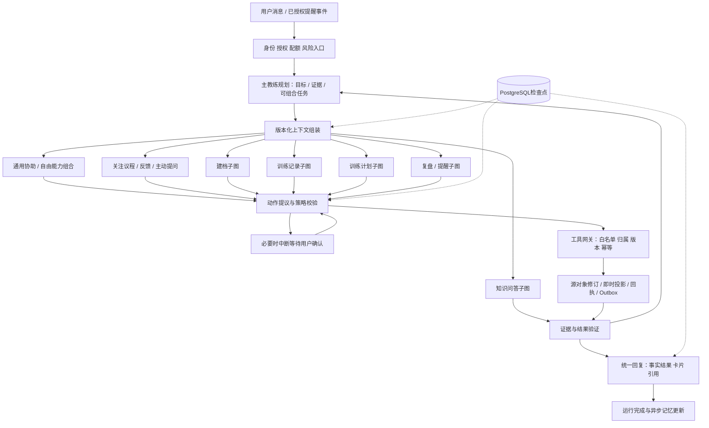

# Agent架构优化设计

版本：v1.2｜日期：2026-09-25｜状态：开放规划器与主动认知循环同步；尚未实现

## 1. 决策摘要

采用**主教练规划器 + 可组合能力/子图 + LangGraph持久化编排 + 独立工具网关与领域事务**。主教练自主分解目标和选择交流策略；建档、记录、计划等是模板，不是固定六选一流程。general_assist处理未知表达，inquiry/feedback主动发现问题、提问和吸收回应，详见25/28。

LangGraph承担状态转移、条件分支、检查点和中断恢复；领域服务承担权限、版本、幂等与事实写入。仅在需要自然语言理解、个性化建议或综合解释时调用模型。无需把动作查询、保存记录、肌肉计算都交给模型反复推理。

相对08原版线性流程，此方案解决：复杂任务跨轮继续、部分工具成功后的恢复、训练中途改口、引用撤回、后台提醒与用户对话争抢，以及多次模型调用的预算失控。引入框架不自动解决这些问题，以下约束必须由应用实现。

## 2. 结构

图中回路受步骤、时间、调用次数和成本上限共同限制。等待用户确认期间释放执行资源；收到明确拒绝则终止对应动作，不要求用户被迫继续。

## 3. 路由与任务契约

页面读取直接调用能力；自然语言建立任务目标与证据图，不要求命中有限意图枚举。多意图形成DAG，独立读取可并行；先保存已知自述再执行有依赖的计划调整，不要求填完所有字段才继续帮助。模板可以跳过、交织或跨轮调用。

| 能力模板 | 相关上下文（按任务获取） | 输出/终止条件 | 必须保持的边界 |
|---|---|---|---|
| Profile | 个人对象、用户新陈述 | 渐进理解/自由属性/候选问题 | 不设全局完整性门槛，推测与事实分开 |
| TrainingRecord | 自述、活动候选及来源 | 已存对象、可用投影、补充议程 | 先存已知，计算条件按消费者 |
| Plan | 当前目标、实际相关条件 | 灵活方案、执行变化集 | 已审适用性；一次意图或有限委托授权 |
| Knowledge | 问题、适用条件、知识版本 | 有证据回答/无答案/澄清 | 检索次数按任务预算，不编来源 |
| Review | 时间范围、有效事实、算法版本 | 基于快照的复盘、调整草稿 | 不把模型生成总结写回训练事实 |
| Reminder | 授权任务、到期时刻、最新训练状态 | 一条合规站内提醒或skip | 投递前再核授权、静默和频控 |
| Inquiry/Feedback | 相关事实、议程、偏好和已回答内容 | 主动反馈、提问、延期及答案吸收 | 会话内可主动，后台另查授权，不绕过拒绝 |
| GeneralAssist | 用户目标与可用能力 | 读/记/草拟/验证等组合完成新任务 | 未知业务词不拒绝，未知执行能力不伪造 |

主教练可重排/跳过模板，自主反馈和追问；新增个人kind/schema无需新子图或发版。新增真正执行工具须注册效果、权限、费用与评测。schema首先限制信封和执行边界，不将全部自由信息变成必填字段。

v1.2以25定义柔性内核、28定义主动信息循环；23保留可靠执行。TrainingRecord先存源活动再适配，Plan只在替换主计划时校验expected_active_plan_id；局部变化集带实际依赖版本。Inquiry可将一段自然回答转成多个有来源对象，并同时解决多个议程。共享24/27/28的验收语义。

## 4. 状态模型与运行生命周期

最小AgentState分为：

| 组 | 字段 |
|---|---|
| 身份引用 | run_id, user_id（仅服务端注入）, conversation_id, message_id |
| 流程 | graph_version,node,task_id,objective,task_dag,completed_task_ids,status；intent可扩展 |
| 数据版本 | profile_version, training_revision, plan_version, knowledge_release |
| 上下文引用 | object_refs,claim_refs,message_ids,memory_ids,evidence_refs,consent_version,inquiry_refs,interaction_preferences |
| 动作 | changeset_refs,operation_ids,tool_call_ids,execution_receipts,intent_ref,mandate_ref,pending_confirmation_id |
| 预算 | task_budget_id,budget_tier,deadline_at,model_calls,tool_calls,retrieval_rounds,tokens_used,cost_used |
| 输出 | reply_draft, citation_ids, validation_errors, decision_summary |

检查点以引用为主，少量必要文本视作敏感个人数据，不保存内部思维过程。生产使用PostgreSQL checkpointer；MemorySaver仅用于单进程测试，不能用它声明支持重启恢复。

run状态保持queued/running/awaiting_confirmation/succeeded/failed/cancelled。执行时长按任务档，standard初值60秒，deep可异步；跨run仍计同task预算。确认期可按动作配置（初值30分钟），等待不持执行租约；议程deferred不是执行确认。租约默认30秒、10秒续租，恢复查实际回执。

图结构升级时保存graph_version；未完成运行由兼容版本继续，无法兼容则取消并告知重新发起。不能让旧节点名直接恢复到不兼容的新图。

## 5. 检查点与业务写入的一致性

检查点不是业务幂等账本。工具网关执行前固定task_id与operation_id，并绑定意图、参数哈希及源活动引用；业务唯一键为(user_id,operation_id)。run_id/tool_call_id保留调用审计映射。同一逻辑动作跨run恢复也复用operation_id；后来真实补充内容是新operation，但仍指向原活动ID。

工具事务步骤：校验用户→查询operation回执（相同ID与哈希已成功则直接返回，不因旧expected_version拒绝重试）→不同哈希拒绝→校验当前授权、数据版本和租约→写源事实/即时投影/版本→写operation成功回执与tool_execution映射→写outbox→同一数据库事务提交。之后再保存图检查点。

提交前宕机无事实落库；提交后检查点前宕机，恢复通过tool_execution回执识别已成功，不重复写入。对具有独立数据库/外部供应商副作用的操作不能假装同事务，改为领域outbox驱动的幂等投递和对账；MVP不让模型直接调用付费或外部发送接口。

工具部分成功：保留已提交事实，失败动作明确报告；不盲目回滚已完成训练。需要原子性的一组改动由一个领域工具包在同一事务内。工具结果状态必须区分succeeded/rejected/failed/retryable，回复只可依据真实回执说“已记录”。

## 6. 确认、中断与并发

confirmation绑定user_id、run_id、proposal_hash、资源版本、expires_at及state_version。用户接受后原子消费确认票据；重复确认返回既有结果。若资源版本或授权已变，拒绝旧确认并重新生成差异预览，不在后台替换参数。

明确自述即使不完整也可保存；已有意图/有效委托覆盖的可逆操作不重复确认，超范围或高影响按25 AU-09升级。提问信息与请求授权分开，用户回答感受不等于授权重写全部计划。计算缺口不当作保存失败。

建议每用户一个前台副作用运行，后台提醒遇到活跃前台运行延迟。等待确认不持锁，新消息可正常处理；若修改了旧确认依赖的数据，旧票据失效。进程内锁不足以防多实例竞争，采用数据库租约+单调fencing_token；领域写入校验当前token，失去租约的旧worker不能继续提交。

取消信号每个模型/工具边界检查。已经提交的训练不能因取消而消失；如果事务正在执行，取消结果中返回已完成部分，其余停止。新消息不无条件中断正在提交的数据库事务。

## 7. 记忆与上下文预算

权威顺序：用户本轮明确纠正→有明确来源的源声明→有效训练/计划投影→来源可追溯摘要→语义候选；明确自述不因未适配标准表就被旧投影覆盖。冲突事实澄清，不用向量相似度决定真伪。

建议standard首版输入上下文预算12,000 token：系统/工具2,000、当前消息和近期会话3,000、个人对象/训练/议程摘要3,000、检索证据3,000、余量1,000；输出每次初始上限1,500 token。按任务档及模型窗口配置，实际按tokenizer统计并给余量；压缩优先丢弃旧闲聊，不丢弃当前限制、单位、用户纠正和权限边界。

上下文加载记录版本快照，提交前检查所依赖版本仍有效。记忆更新异步且可重建，失败不阻断训练保存；源事实变更使旧记忆失效。长会话摘要每到token水位触发，不是每轮都重新摘要。

## 8. RAG与计划校验优化

检索前将问题拆为动作身份、操作要点、适用条件等查询；对明确动作优先命中字典和关联知识，再进行关键词/向量检索。公共内容检索和个人记忆检索使用不同集合与访问规则。沿用08的混合检索、重排和版本引用。

standard初始允许一次改写扩大检索；其他任务档按预算与信息增益决定，无进展则停止。证据验证包括版本有效、引用存在、适用条件、结论支持四层。前三层尽可能确定性校验；语义支持使用有限模型复核及人工评测，不能用模型自信分数替代验证。

计划采用“灵活方案→选择可执行部分→逐动作验证→预算内按进展修复”。实际需要的动作才校验证据；无进展交付有用部分再收束，不固定修复一次就拒绝整项服务。已知限制、内容适用性和授权边界不变，灵活payload不能绕过。

## 9. 性能与成本预算

| 路径 | 模型调用目标 | 工具/检索边界 | 降级 |
|---|---:|---|---|
| 明确页面读取 | 0 | 领域API读取 | 缓存公共内容 |
| 简单训练记录 | 1—2 | 消歧/写入/回执，≤6工具 | 表单/快捷记录 |
| 专业问答 | 1—3 | ≤2轮检索，总≤6工具 | 已审内容+明确无充分证据 |
| 计划或复盘 | 2—4 | standard初值总≤6工具，按剩余预算与进展修复 | 保留旧计划，返回有用部分及未完成原因 |
| 主动提醒 | 0—1 | 规则先筛选 | 固定审核文案或跳过 |

上表调用次数改为standard档初始性能目标，并非所有任务固定上限。服务端提供quick/standard/deep预算；standard可沿用4模型/6工具/2检索/24步/60秒初值，复杂有效任务可申请deep。模型不能自己扩权；子任务、重试、改写均计同task累计费用，无进展循环终止。预算结束保存中间结果，说明尚未完成部分。

模型调用前按最大输出预算预留额度，返回后以实际计费对账；用户和全局配额原子扣减，取消/失败释放未使用预留。只允许已经评测且数据处理政策兼容的备用供应商。故障切换不重放已提交副作用。

可并行读取独立画像、训练摘要和公共知识以降低延迟；写操作按依赖顺序串行。此处指应用运行时I/O并发，不要求多个自主Agent互相委派任务。

## 10. 可观测性与验证

每个节点记录trace_id、run_id、graph_version、节点耗时、工具状态、token和预算余量；默认不记录提示词原文。新增指标：子图路由正确率、平均模型调用数、每成功任务成本、人工确认率、陈旧确认拒绝率、工具重放去重数、恢复成功率、记忆冲突率。

新增必测案例：

- AG01：训练提交后、检查点前进程崩溃，重启只有一次事实写入。
- AG02：两次确认同时到达，仅消费一次；资源版本变更后旧确认被拒绝。
- AG03：旧worker租约过期，新worker接管，旧token写入被拒绝。
- AG04：用户先确认重量后纠正，恢复运行使用新事实，旧摘要不覆盖。
- AG05：知识在生成与发送之间撤回，发送前校验阻止失效引用。
- AG06：恶意输入要求无限检索或递归任务，硬预算终止，核心记录仍可用。
- AG07：一个工具成功后另一工具失败，只报告真实部分成功，不重做成功动作。
- AG08：用户注销后所有run、confirmation、checkpoint和语义记忆不可恢复读取。
- AG09：取消发生在业务提交后，已完成记录保持存在，未执行动作停止。

G1比较原始线性基线与新架构，固定08的测试集、供应商和知识版本；报告正确率、p95时延、token/成功任务、重复写入及恢复率。先要求质量不退化，再评估性能收益；本设计不预先声称“提速多少”或“节省多少成本”。

## 11. 实施顺序与当前完成度

先固定状态/工具/回执协议→实现可注入模型和仓储端口→跑只读问答子图→接训练记录事务与故障恢复→接计划及确认→接记忆与提醒→执行离线评测和真机闭环。

本轮产物为优化设计与本机环境准备。图节点、数据库迁移、真实模型适配器、故障恢复测试尚未实现；依赖可导入不等于Agent功能完成。业务实现遵循已确认范围和C10的文档冻结流程。

## 12. 主动认知与交流循环

用户消息、训练事件、返回产品或合法到期事件触发后，主教练读取相关议程与偏好，选择直接帮助、反馈观察、主动提问、执行已授权行动、延期或安静。无需每次经过单独问卷子图。用户回答可同时新增多个属性、纠正假设并解决多个议程。

关注点可长期open/deferred，但不能持续占计算资源或自动无限调用模型。后台投递前核对answer_revision与inquiry_version，已回答/拒绝时取消。PI策略与PQ用例见28，与原AG恢复用例共同验收。
