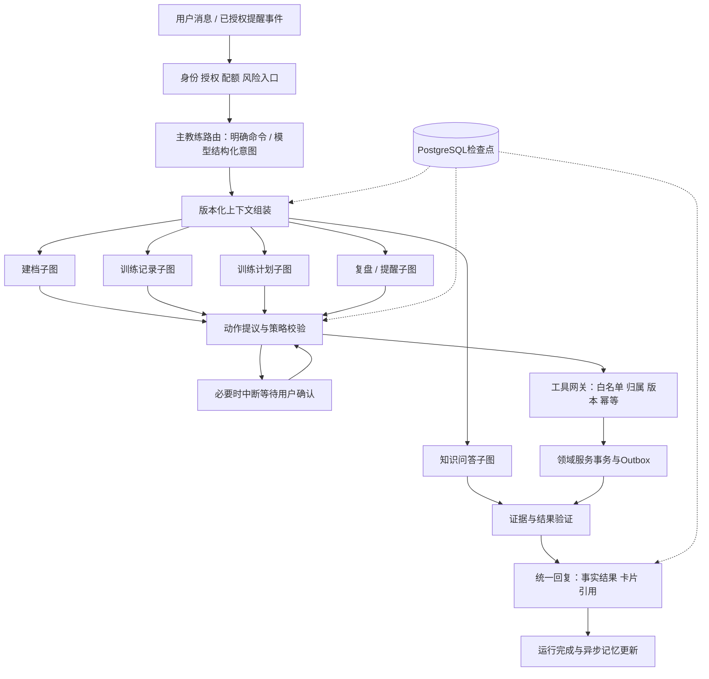

# Agent架构优化设计

版本：v1.1｜日期：2026-09-25｜状态：业务契约同步；实施效果待G1验证

## 1. 决策摘要

采用**单一主教练入口 + 专项任务子图 + LangGraph显式状态编排 + 独立工具网关与领域事务**。主教练维护统一人格和对话语境；建档、训练记录、计划、知识、复盘、提醒是有输入输出契约的子图，不是各自自由聊天的多个机器人。

LangGraph承担状态转移、条件分支、检查点和中断恢复；领域服务承担权限、版本、幂等与事实写入。仅在需要自然语言理解、个性化建议或综合解释时调用模型。无需把动作查询、保存记录、肌肉计算都交给模型反复推理。

相对08原版线性流程，此方案解决：复杂任务跨轮继续、部分工具成功后的恢复、训练中途改口、引用撤回、后台提醒与用户对话争抢，以及多次模型调用的预算失控。引入框架不自动解决这些问题，以下约束必须由应用实现。

## 2. 结构

图中回路受步骤、时间、调用次数和成本上限共同限制。等待用户确认期间释放执行资源；收到明确拒绝则终止对应动作，不要求用户被迫继续。

## 3. 路由与任务契约

固定入口如“打开动作详情”直接调用领域读取；自然语言通过小型结构化意图输出，使用一个主模型的轻量提示先验证，不强制增加第二个供应商。多意图拆成有序任务列表，例如“记录今天卧推，再调整明天计划”必须先写入训练事实，再基于新版本生成计划。

| 子图 | 必须输入 | 输出/终止条件 | 主要约束 |
|---|---|---|---|
| Profile | 已确认画像版本、用户新陈述 | 字段候选/澄清问题/确认摘要 | 推断与事实分开；一次最多2问 |
| TrainingRecord | 训练会话、动作候选、用户陈述 | 规范化组数据、待澄清字段、写入回执 | 动作消歧和单位先完成；“练完了”不代表计划全部完成 |
| Plan | 确认画像、器械、时间、限制、训练revision | 校验通过的计划draft | 只用已审动作；采纳才active |
| Knowledge | 问题、适用条件、知识发布版本 | 有证据回答/无答案/澄清 | 所有专业结论绑定证据；最多2轮检索 |
| Review | 时间范围、有效事实、算法版本 | 基于快照的复盘、调整草稿 | 不把模型生成总结写回训练事实 |
| Reminder | 授权任务、到期时刻、最新训练状态 | 一条合规站内提醒或skip | 投递前再核授权、静默和频控 |

主教练可在这些能力内自由选择信息组织与展示，不将每位用户限制到相同问卷。新增子图需注册任务schema、工具权限、费用预算、评测集，不默认获得全部工具。

v1.1将业务规则集中到23，子图只负责收集输入和提出动作。TrainingRecord区别实时会话与完整补录，Plan携带expected_active_plan_id及输入版本，Review输出包含事实revision，Reminder先执行BR-13再调用模型。所有子图共享22的功能完成条件与24的B01—B28案例，不能各自改变“完成训练”“撤回授权”等定义。

## 4. 状态模型与运行生命周期

最小AgentState分为：

| 组 | 字段 |
|---|---|
| 身份引用 | run_id, user_id（仅服务端注入）, conversation_id, message_id |
| 流程 | graph_version, node, intent, task_queue, completed_task_ids, status |
| 数据版本 | profile_version, training_revision, plan_version, knowledge_release |
| 上下文引用 | message_ids, memory_ids, evidence_refs, consent_version |
| 动作 | proposals, tool_call_ids, execution_receipts, pending_confirmation_id |
| 预算 | deadline_at, model_calls, tool_calls, retrieval_rounds, tokens_used, cost_used |
| 输出 | reply_draft, citation_ids, validation_errors, decision_summary |

检查点以引用为主，少量必要文本视作敏感个人数据，不保存内部思维过程。生产使用PostgreSQL checkpointer；MemorySaver仅用于单进程测试，不能用它声明支持重启恢复。

外部run状态统一为queued/running/awaiting_confirmation/succeeded/failed/cancelled。executing_tool等为内部节点。running累计执行上限60秒，等待确认不计执行时间；确认默认30分钟过期，过期转cancelled(reason=confirmation_expired)。租约建议30秒、每10秒续租，恢复从最后可验证回执开始。

图结构升级时保存graph_version；未完成运行由兼容版本继续，无法兼容则取消并告知重新发起。不能让旧节点名直接恢复到不兼容的新图。

## 5. 检查点与业务写入的一致性

检查点不是业务幂等账本。工具网关在执行前固定tool_call_id，计算参数哈希，构造业务键(user_id,run_id,tool_call_id)。一个逻辑动作恢复后复用相同ID，不能重新生成ID后再执行。

工具事务步骤：校验用户与数据版本→查询已有tool_execution→相同ID及哈希已成功则返回原回执→不同哈希拒绝→写领域事实/版本→写tool_execution成功回执→写outbox→同一数据库事务提交。之后再保存图检查点。

提交前宕机无事实落库；提交后检查点前宕机，恢复通过tool_execution回执识别已成功，不重复写入。对具有独立数据库/外部供应商副作用的操作不能假装同事务，改为领域outbox驱动的幂等投递和对账；MVP不让模型直接调用付费或外部发送接口。

工具部分成功：保留已提交事实，失败动作明确报告；不盲目回滚已完成训练。需要原子性的一组改动由一个领域工具包在同一事务内。工具结果状态必须区分succeeded/rejected/failed/retryable，回复只可依据真实回执说“已记录”。

## 6. 确认、中断与并发

confirmation绑定user_id、run_id、proposal_hash、资源版本、expires_at及state_version。用户接受后原子消费确认票据；重复确认返回既有结果。若资源版本或授权已变，拒绝旧确认并重新生成差异预览，不在后台替换参数。

明确且完整的训练陈述可直接记录并提供纠错入口；删除历史、合并、多义单位和计划采纳按03/08的业务规则确认。设计目标是减少不必要确认，同时保证高影响动作可控。

建议每用户一个前台副作用运行，后台提醒遇到活跃前台运行延迟。等待确认不持锁，新消息可正常处理；若修改了旧确认依赖的数据，旧票据失效。进程内锁不足以防多实例竞争，采用数据库租约+单调fencing_token；领域写入校验当前token，失去租约的旧worker不能继续提交。

取消信号每个模型/工具边界检查。已经提交的训练不能因取消而消失；如果事务正在执行，取消结果中返回已完成部分，其余停止。新消息不无条件中断正在提交的数据库事务。

## 7. 记忆与上下文预算

权威顺序：用户本轮明确纠正→已确认结构化事实→有效训练与计划→来源可追溯摘要→语义候选。冲突事实澄清，不用向量相似度决定真伪。

建议首版输入上下文预算12,000 token：系统/工具2,000、当前消息和近期会话3,000、画像/训练摘要3,000、检索证据3,000、余量1,000；输出每次上限1,500 token。实际按模型tokenizer统计并给余量；压缩优先丢弃旧闲聊，不丢弃当前限制、单位、用户纠正和权限边界。

上下文加载记录版本快照，提交前检查所依赖版本仍有效。记忆更新异步且可重建，失败不阻断训练保存；源事实变更使旧记忆失效。长会话摘要每到token水位触发，不是每轮都重新摘要。

## 8. RAG与计划校验优化

检索前将问题拆为动作身份、操作要点、适用条件等查询；对明确动作优先命中字典和关联知识，再进行关键词/向量检索。公共内容检索和个人记忆检索使用不同集合与访问规则。沿用08的混合检索、重排和版本引用。

Query1未命中时允许一次改写扩大检索；仍无证据则停止。证据验证包括版本有效、引用存在、适用条件、结论支持四层。前三层尽可能确定性校验；语义支持使用有限模型复核及人工评测，不能用模型自信分数替代验证。

计划生成采用“结构化候选→确定性校验→最多一次修复”。校验动作是否已发布、器材可用、时间预算、单位、重复安排、用户限制与专家规则。伤病限制不够明确时先澄清，不单靠关键词过滤宣称安全。修复仍失败返回缺口，不无限循环。

## 9. 性能与成本预算

| 路径 | 模型调用目标 | 工具/检索边界 | 降级 |
|---|---:|---|---|
| 明确页面读取 | 0 | 领域API读取 | 缓存公共内容 |
| 简单训练记录 | 1—2 | 消歧/写入/回执，≤6工具 | 表单/快捷记录 |
| 专业问答 | 1—3 | ≤2轮检索，总≤6工具 | 已审内容+明确无充分证据 |
| 计划或复盘 | 2—4 | 总≤6工具，最多一次修复 | 保留旧计划，返回草稿失败原因 |
| 主动提醒 | 0—1 | 规则先筛选 | 固定审核文案或跳过 |

每run硬上限4次模型、6次工具、2轮检索；结构修复、改写和验证都计入限额，不存在“免费额外重试”。整个run同时受60秒和费用配额约束。图步数额外上限24，防止不消耗模型的程序循环。

模型调用前按最大输出预算预留额度，返回后以实际计费对账；用户和全局配额原子扣减，取消/失败释放未使用预留。只允许已经评测且数据处理政策兼容的备用供应商。故障切换不重放已提交副作用。

可并行读取独立画像、训练摘要和公共知识以降低延迟；写操作按依赖顺序串行。此处指应用运行时I/O并发，不要求多个自主Agent互相委派任务。

## 10. 可观测性与验证

每个节点记录trace_id、run_id、graph_version、节点耗时、工具状态、token和预算余量；默认不记录提示词原文。新增指标：子图路由正确率、平均模型调用数、每成功任务成本、人工确认率、陈旧确认拒绝率、工具重放去重数、恢复成功率、记忆冲突率。

新增必测案例：

- AG01：训练提交后、检查点前进程崩溃，重启只有一次事实写入。
- AG02：两次确认同时到达，仅消费一次；资源版本变更后旧确认被拒绝。
- AG03：旧worker租约过期，新worker接管，旧token写入被拒绝。
- AG04：用户先确认重量后纠正，恢复运行使用新事实，旧摘要不覆盖。
- AG05：知识在生成与发送之间撤回，发送前校验阻止失效引用。
- AG06：恶意输入要求无限检索或递归任务，硬预算终止，核心记录仍可用。
- AG07：一个工具成功后另一工具失败，只报告真实部分成功，不重做成功动作。
- AG08：用户注销后所有run、confirmation、checkpoint和语义记忆不可恢复读取。
- AG09：取消发生在业务提交后，已完成记录保持存在，未执行动作停止。

G1比较原始线性基线与新架构，固定08的测试集、供应商和知识版本；报告正确率、p95时延、token/成功任务、重复写入及恢复率。先要求质量不退化，再评估性能收益；本设计不预先声称“提速多少”或“节省多少成本”。

## 11. 实施顺序与当前完成度

先固定状态/工具/回执协议→实现可注入模型和仓储端口→跑只读问答子图→接训练记录事务与故障恢复→接计划及确认→接记忆与提醒→执行离线评测和真机闭环。

本轮产物为优化设计与本机环境准备。图节点、数据库迁移、真实模型适配器、故障恢复测试尚未实现；依赖可导入不等于Agent功能完成。业务实现遵循已确认范围和C10的文档冻结流程。
