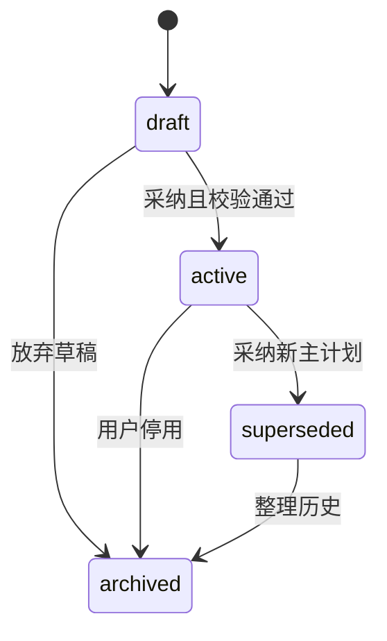
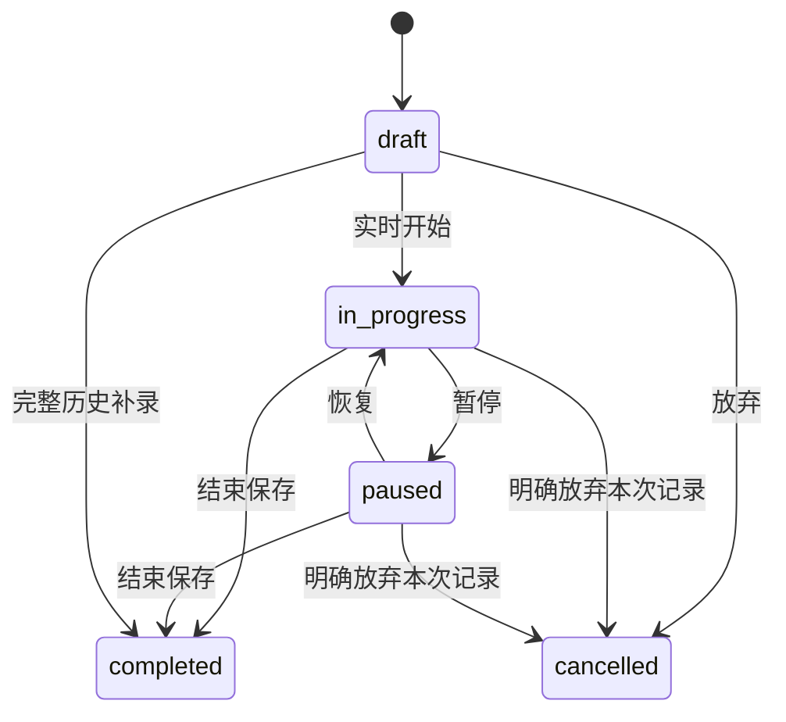

# 业务规则与状态机

版本：v1.1｜日期：2026-09-25｜状态：功能逻辑细化；具体实现与验收待开发

## 1. 业务术语与事实所有权

| 对象 | 含义 | 权威数据来源 |
|---|---|---|
| 画像 | 用户确认目标、条件与限制 | profiles及字段来源/版本 |
| 计划 | 建议做什么，一个可采纳文档版本 | plans |
| 计划项occurrence | 一次预定训练安排，区别于整个计划 | plan_occurrences |
| 训练会话session | 一次实际训练或明确的历史补录 | training_sessions |
| 动作条目entry | 会话内动作的一次出现；允许同动作多次出现 | training_entries |
| 组set | 实际次数/时长/负重数据 | training_sets |
| 卡片 | 自有内容或其他事实的展示入口 | cards；source_ref指向源对象 |
| 估算/复盘 | 基于事实生成的派生结果 | 带revision的投影，不作为事实输入 |

前端、Agent、后台调用相同领域命令。页面没有权限代表后端也必须拒绝；直接调用API不得绕过流程。跨对象的user_id、授权版本、发布版本均在服务端验证。

## 2. BR-01 能力与授权矩阵

用途键固定为personal_training（存储及展示个人训练）、health_profile（个性化画像含限制）、ai_coaching（将必要上下文送给获准模型处理）、proactive_reminders（主动站内提醒）。外部通知另受平台票据控制，不由站内同意代替。

| 身份/条件 | 公共浏览 | 个人记录/历史 | 个性计划/AI复盘 | 站内主动提醒 | 导出/删除 |
|---|---|---|---|---|---|
| 游客 | 是 | 否 | 否 | 否 | 否 |
| 成年登录+personal_training | 是 | 是 | 否 | 否 | 本人数据可管理 |
| 再加health_profile+ai_coaching及必要字段 | 是 | 是 | 是 | 未开启则否 | 是 |
| 再加proactive_reminders | 是 | 是 | 是 | 按规则与频控 | 是 |
| 撤回AI处理 | 是 | 个人记录授权仍有效时是 | 否，待确认AI动作失效 | 仅已同意的规则模板可用，不新调用模型 | 是 |
| 撤回personal_training | 是 | 停止常规处理与展示 | 停止依赖训练的个性生成 | 停止依赖训练的提醒 | 保留再认证后的数据权利入口 |
| 注销处理中 | 公共匿名入口可用 | 否 | 否 | 否 | 仅注销回执渠道，不允许新导出 |

health_profile撤回使画像字段与派生记忆退出教练处理；不默认撤销personal_training。用户明确拒绝健康限制信息时仍可自主记录训练，但不开放个性负荷建议。所有用途的再次同意产生新consent_version，旧运行不因重新同意自动恢复。

## 3. BR-02 画像确认与缺失值

字段具有value、source_kind=user/model_candidate、source_ref、observed_at、confirmed_at。null表示未知；declined表示用户不愿提供；“无已知限制”是明确用户陈述。这三者不能混同。字段纠正后旧向量记忆即时逻辑失效，再异步清理。

onboarding_status=completed表示至少曾完成一次必要字段确认，不意味着未来没有缺口。字段删除或授权变化返回missing_requirements，按具体能力阻断；不要把历史completed状态覆盖成“从没建档”。

## 4. BR-03 变化影响优先级

安全限制/服务资格/授权变化 > 用户本轮已确认事实 > 当前有效结构化事实 > 当前计划 > 模型估算 > 普通偏好。高优先级限制不因热力图绿色、目标紧迫或会员权益失效。

| 变化 | 立即同步处理 | 异步/后续 |
|---|---|---|
| 目标、器材、时间变化 | 画像version递增，相关计划review_status=needs_review | 提议新草稿，旧训练快照不变 |
| 用户报告新的不适/限制 | 相关计划blocked；不能确定关联时整个未来计划需复核 | 专业知识检索/调整草稿；当前训练可记录已完成部分 |
| 动作/知识撤回 | 新调用和受影响计划项启动校验阻断 | 清理缓存，标记旧建议引用状态 |
| 单条训练修订/删除 | 用户training_revision递增；旧确认若依赖该版本则失效 | 投影和复盘重算/标过期 |

review_status为计划资格属性valid/needs_review/blocked，不与draft/active生命周期混用。needs_review的计划需要展示差异并再次确认兼容性后才允许启动受影响项；blocked必须先调整、核实限制或撤回原因，用户不能点击“忽略”直接执行。

## 5. BR-04 意图、确认与幂等

| 操作 | 条件 | 确认方式 |
|---|---|---|
| 查询/导航 | 有读取权限 | 无需额外确认 |
| 明确完整的训练记录 | 动作、单位、时间、会话归属清楚 | 用户原指令可作为授权，成功给纠错入口 |
| 模糊补录/修改 | 多个候选对象或单位歧义 | 提问补全，不执行候选猜测 |
| 计划采纳 | 校验通过的最新draft | “采纳计划”按钮或能唯一指向草稿的明确回复 |
| 高影响删除/放弃已完成组 | 展示目标与影响 | 页面预览确认或Agent票据，不叠加两次同义确认 |
| 卡片隐藏/置顶 | 本人卡片 | 直接执行，可恢复 |
| 注销/导出 | 本人且近期再认证 | 再认证+明确操作，不只根据聊天文字执行 |

技术幂等解决相同请求重试；不同请求的相似内容只做业务重复提示。会话建立用client_session_id、消息用client_message_id、组用set_id保持身份。HTTP幂等键至少24小时，业务唯一约束独立存在；相同键不同参数409，不更新第一次结果。

## 6. BR-05 计划状态与采纳事务

一个用户至多一个active主计划；superseded/archived不可原地变回active，复用要复制新draft并重新校验。draft可就地加version；active修改创建新plan_id的draft并带replaces_plan_id。一次采纳事务锁用户计划范围，核对draft版本、expected_active_plan_id（允许null）、画像/训练/内容版本，替换旧计划并更新计划项及outbox。

两个草稿同时采纳时，只有第一个满足expected_active_plan_id；第二个409，不能以最后写入胜出覆盖刚采纳的计划。生成中的草稿基于旧画像，返回时标stale，不能直接采纳。

## 7. BR-06 计划项与履约

occurrence状态：scheduled → in_progress → completed/partial；scheduled可skipped（用户选择）、missed（过有效期）、cancelled（计划调整取消）。completed/partial取决于有效实际组与冻结目标的映射，不取决于一句“完成”。

MVP每occurrence同时最多关联一个正在执行或有效completed会话；完成后不再绑定另一实时会话，补录也不能占用正在执行的计划项。续练在同一实时会话暂停/恢复，不自动拼接两次独立训练。自由训练不自动满足计划项；开始时绑定或补录时明确选择一个匹配occurrence。动作替换需在未开始计划草稿里完成；现场新增动作可以记录，但不凭模型判断抵扣原动作。

计划采纳后修改排期生成新draft。未变更且未开始项目复用occurrence_id及保留历史关联；日期、动作或目标变化的项目创建新occurrence_id，旧未开始项cancelled(reason=plan_replaced)。进行中项保持旧计划快照及关联，新的草稿不得重复生成同一未完成安排，若冲突则采纳前提示并调整。

目标组使用稳定plan_set_id。匹配该ID、相同动作/计量类型且标明completed的有效work组算完成目标，不要求达到建议重量/次数才能保存真实完成；实际低于目标另外展示差距。未做的目标组仍未完成；额外组可记实际量，但不提高计划完成率到100%以上。

计划项计划组完成率=完成目标work组数/冻结目标work组数；目标0组则不生成训练项。完成全部目标为completed，有至少1个目标组但不足为partial；仅做额外组/热身也保存实际会话，其occurrence可partial且目标完成率0%。未发生训练则skipped/missed；取消计入哪些统计见BR-15。

## 8. BR-07 实际训练状态与完成条件

draft→completed只允许专用retroactive补录命令；普通PATCH不能跳过完整校验。实时会话在用户范围设置部分唯一约束status∈{in_progress,paused}且deleted_at为空；历史补录以原子命令完成，不占实时名额。

完成条件为至少1个有效完成组（包括仅热身的真实训练）；无有效work组则completion_kind=warmup_only，不计北极星指标或肌肉负荷。自由训练有work组为free，关联计划按BR-06为full/partial。completed以后仅走修订，业务status保持completed；删除是deleted_at标记，不以cancelled代替删除。

取消已录组需明确放弃，提示不进入统计。删除某个未完成组不变更其他组ID和ordinal；ordinal允许空隙。同动作多次出现用entry_id区分；已结束时增加漏记组、删除误记组均通过完整修订快照处理。

entry标skipped时不得仍含completed组；已有完成组应保留为实际完成部分，不能通过“跳过”清零。API不根据entry.status自动勾选所有组，组完成始终需要实际数据。MVP的entry.completed仅表示该条目已结束录入，不能代替计划组完成率。

## 9. BR-08 时间、计量与补录

| 项目 | 规则 |
|---|---|
| 时间保存 | 服务器UTC，业务发生时保存timezone及local_date快照；后改账号时区不重新归属旧历史 |
| 实时归属 | 按开始时所在当地日期；结束可跨午夜，不拆成两次训练 |
| 相对日期 | “昨天”锚定该消息首次accepted_at及当时用户时区，重试跨午夜不重新解释 |
| 补录精度 | exact：有可信开始/结束；date：仅有当地日期，真实started_at/ended_at可null |
| 日期型估算锚点 | derived_effective_at=该日期当地23:59:59与消息首次accepted_at中的较早者；只供近似衰减，显示“时间不详，按日期估算”并降置信度 |
| 未来时间 | 实际训练结束不得晚于服务器当前时刻，设备偏差先纠正或确认真实时间，不能无声截断用户数据 |
| 时长 | exact且暂停区间完整时算elapsed与active；date精度时长null，允许另记用户自述reported_duration_seconds并标来源 |
| 重量 | kg规范化，保留输入单位；哑铃weight_kg为每只、implement_count为1或2；bodyweight重量可null |
| 次数/时长 | measurement_type=reps时reps正整数且duration_seconds=null；duration时反之；完成前的空白目标不当有效组 |
| 组类型 | set_kind=work/warmup；RPE可null，已填写为1—10整数；无法描述的计量留草稿待澄清 |

日期型锚点是计算假设，不展示成真实训练结束时刻。近7天频率与指数计算采用effective_at，日报/周报按local_date，不混用。日期型记录不参与依赖精确时长的热量估算。修改实际日期重新生成锚点并重算。

重量比较必须含exercise_id、load_mode、implement_count及可选equipment_instance_ref/side；器械型号不明则不生成跨会话器械力量趋势。A0计时work组暂不纳入肌肉疲劳/刺激，保留记录与工作组统计，UI标注覆盖不足；这保留记录能力而不发明时长负荷公式。

## 10. BR-09 重复、离线与多设备

网络中断只允许编辑本地训练草稿，不在本地宣称已completed上云。同步队列保留操作ID、对象ID、expected_version、基线快照和发生顺序。客户端依次提交；超时先按同一键查询/重试，不新增组ID。

409时拉取最新状态：若双方修改不同组，可展示合并预览并由用户采纳；同组同字段冲突必须选择保留哪项。MVP不做静默最后写入覆盖。服务端已completed则本地未同步修改只能转为修订预览，不能把状态倒退到in_progress。

退出/切号前若有未同步内容提示保存或放弃；注销不因草稿未同步阻止用户行使删除权。草稿含身份scope，登录另一账号时绝不上传到新用户。过期令牌不自动废弃草稿；重新认证后只同步同一用户内容。

## 11. BR-10 卡片内容归属

卡片binding_kind=owned/reference。owned可以编辑content；reference含source_ref={entity_type,id}及source_version，仅允许修改title/display/pinned等展示属性。源字段编辑必须调用领域接口。由源更新刷新reference卡不能覆盖用户pinned/hidden选择。

active和archived均可删除，deleted为终态；隐藏visible=false不是归档。source_ref删除立即使reference内容不可读取，可显示不含旧快照的“来源已删除”。模型不能自动从记忆重新创建用户删掉的卡片内容。

## 12. BR-11 事实与派生更新

用户training_revision为单调递增的全局训练事实版本，完成/修订/删除一次事务递增一次；不同会话的version不能互相比较。肌肉投影保存source_revision与algorithm/mapping版本，过期结果禁止覆盖新结果。

读路径检查版本和as_of，表示ready/updating/failed，而不是前端猜测。固定事实随时间衰减，因此无新训练也要按查询时刻更新/计算快照；缓存最长5分钟是初始服务参数，返回实际as_of且服务端分类，前端不在旧数值上独立改颜色。

一次肌肉图响应保持同一source_revision、algorithm_version、mapping_version、as_of；不能混用不同肌肉的新旧投影。重算失败仍能查询事实。未覆盖计时/无映射组的coverage返回included_work_sets/total_work_sets及原因，不能拿低覆盖宣称全身状态可靠。

## 13. BR-12 修订、删除和追溯

修订含expected_version、reason和完整entries/sets快照；既有ID必须属于会话，新条目/组使用新的UUID，重复ID拒绝。客户端不能伪造历史revision；服务器保留before/after并标actor。移除全部有效完成组须改走整会话删除，不能留下“完成但没有训练”的有效事实。

历史删除事务设置deleted_at、递增training_revision、失效直接引用、解绑有效履约并写outbox；后台物理清理在策略窗口内进行。关联occurrence若无其他有效完成事实，按当前时间恢复scheduled或missed；被替换/归档的旧项目保持cancelled或历史状态并显示履约记录已删除，不生成过期提醒。用户手动删除的记录不因消息回放重建。

被删记录的敏感before/after、消息提取、卡片缓存和语义记忆同步禁止查询，再级联清除；审计仅保留必要操作元数据。注销全链路清理规则覆盖检查点、票据、导出和备份清单。

## 14. BR-13 提醒决策表

判断顺序：用户及用途有效→事件仍相关→计划/限制允许→频控→静默/时区→投递。每条决策存reason_code，不为每个被跳过候选调用模型。

| 候选 | 默认到期规则 | 有效期/去重 |
|---|---|---|
| 计划提醒 | 用户选择开始时刻前30分钟；未选时刻不强行推算 | 最晚为计划当地日结束；occurrence_id+kind唯一 |
| 训练后感受 | 实际完成后次日用户设定时间；日期补录不追发旧回访 | 到期后24小时；session_id+kind唯一 |
| 久未训练 | 最近有效work会话3×24小时后第一个允许时段 | 有新训练即取消；每个7日窗口最多一次 |

每天最多1条主动站内提醒，按投递时用户当地日期计数，并要求距上一条≥20小时以免时区切换绕过频控。优先顺序：用户主动延后待送→训练后感受→计划提醒→久未训练；被频控的候选若延期后过期则skip，不积压催促。

静默默认22:00—08:00，跨午夜正确处理；用户时区变化重算未投递候选，已发送不重发。DST不存在的时间顺延到首个有效时刻，重复时刻选择首次；系统内部保存UTC时刻。snooze目标需未来且仍在有效期，再次检查静默/频控。一次性平台订阅票据仅影响外部渠道，不删除已生成站内记录。

频控名额、候选状态和站内消息插入在同一用户锁事务内完成，多个worker不能各自读到“今天还没发送”后重复创建。snooze仅用于尚未投递候选，已投递项不重发。外部通知由该站内消息的投递任务驱动并单独去重，不重新消耗每日站内提醒名额。

## 15. BR-14 内容和反馈状态

内容版本生命周期draft→in_review→approved→published；驳回回draft并记录reason；in_review由作者撤回回draft；approved修改必须创建新draft，原批准不沿用。published→withdrawn不可直接恢复，用新版本重新审核。编辑与审核人不得相同，管理员也不能绕过来源和许可校验。

先构建未生效索引，再发布有效指针；查询必须校验published指针和撤回集合，不能只看向量是否存在。动作和设备内容同样受审核，不只管理知识文章。用户反馈open→in_review→resolved/rejected，驳回必须给可读原因；“已处理”不等于承认医学诊断。

## 16. BR-15 指标口径

| 指标 | 分子/分母与时间 |
|---|---|
| 有效训练次数 | 有效completed且至少1个完成work组的会话数，按发生local_date统计；修订不增加次数 |
| 计划履约率 | 周内有至少1个绑定目标work组的occurrence / 周内到期且未因提前改期取消的occurrence；partial算参加，另展示组完成率 |
| 计划组完成率 | 有效完成plan_set_id数 / 冻结目标work组数，最高100%，额外组不进入分子 |
| 北极星指标 | 统计周内有效训练且在同一统计周查看该会话/同期肌肉反馈的用户去重；服务分析按Asia/Shanghai，与个人日历口径分开 |
| 记录纠错率 | 提交后7天内至少一次实质纠错的已完成会话 / 同队列已观察满7天的已完成会话；包含删除，不计仅备注排版 |
| 激活 | 注册后7×24小时内完成画像确认、采纳计划及至少1次有效训练；自由记录用户仍有价值但不冒充该定义的激活 |

用户主动skipped和到期missed保留履约分母；到期后归档/换计划不能抹去历史未完成。首次报表保留版本，修订后可标记已更正；不得把实时重算结果冒充当时发布的报告。零分母显示“暂无安排/数据”，不显示0%或100%。

## 17. BR-16 导出、删除任务与重认证

导出和注销需要5分钟内绑定账号/用途的一次性reauth_token。导出明确snapshot_revision和请求时间，只包含快照前可导出内容；生成期间删除/撤权时重新检查可导出范围，注销则取消并撤销链接。读取任务状态必须验证本人；注销撤销会话后仅允许请求当次返回的不可枚举回执token查询最小状态，不返回任何个人数据或下载链接。

任务queued→running→succeeded/failed，失败可有限重试；删除接受后的online_blocked与physical_cleanup_status分别返回，不能把清理失败当成恢复账号的理由。导出文件24小时清理，15分钟签名链接每次签发校验用户和任务未撤销。任务轮询、下载和对象存储不允许通过猜ID访问。

## 18. 冲突处理责任

领域服务返回规则编号、稳定错误码和可恢复动作；Agent将其解释为用户可理解的话，不能改写实际状态。产品默认值如7日计划、3日提醒、5分钟快照缓存均配置版本化，医学/训练强度参数必须由专家规则库审核，不能借业务规则推导未验证负荷处方。
